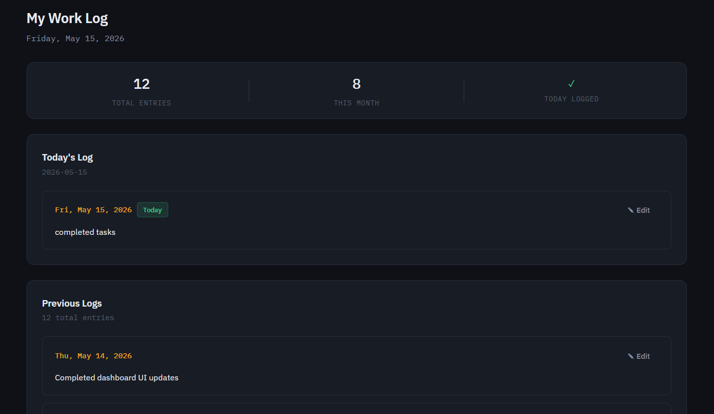
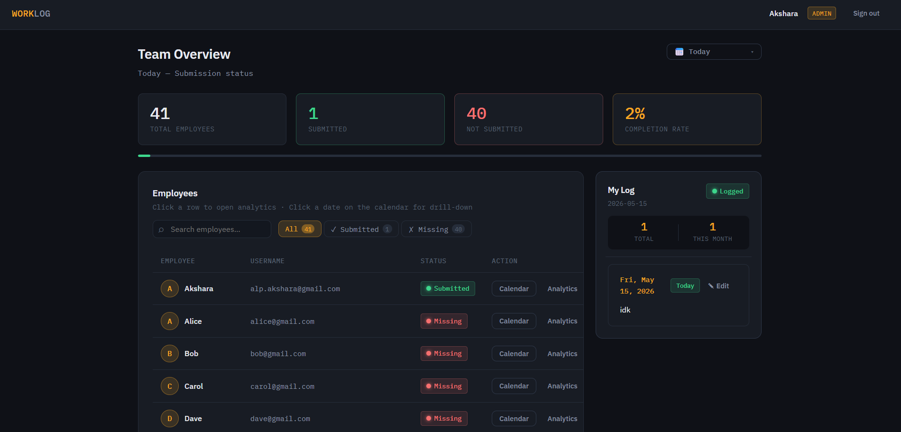
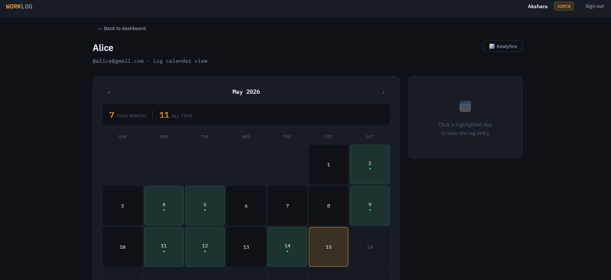
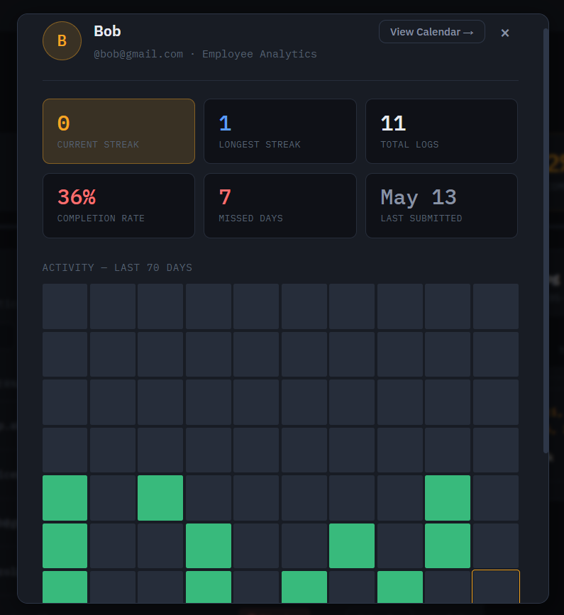
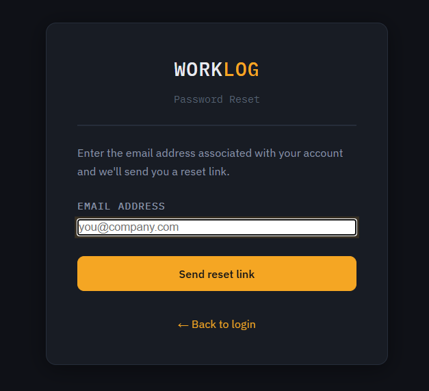

# Worklog Analytics Dashboard

> Internal employee worklog tracking and analytics platform for team productivity visibility.

---

## Overview

 Worklog provides admins with a live submission dashboard, per-employee analytics, and historical drill-down — replacing manual tracking with a structured, data-driven workflow.

---

## Features

- **Daily submission tracking** — employees submit a worklog entry per day; admins see real-time team submission status
- **Date range analytics** — filter overview by Today, Yesterday, Last 7 Days, or a custom date range
- **Daily drill-down** — click any date to see exactly who submitted and who didn't, with completion percentage
- **Calendar view** — per-employee log calendar with clickable day entries
- **Employee analytics** — current streak, longest streak, total submissions, missed days, completion rate, and a 70-day activity heatmap
- **Search & status filtering** — debounced search combined with Submitted / Missing / All filters across all employee lists
- **Password reset via email** — token-based reset flow using Resend

---

## Screenshots

### Dashboard - employees


### Dashboard - admins


### Calendar View


### Employee Analytics


### Change Password


---

## Tech Stack

**Frontend**
- React 18 (Create React App)
- React Router v6
- Vanilla CSS with CSS custom properties — no UI framework
- Native `fetch` API — no Axios

**Backend**
- Node.js + Express 4
- JWT authentication (`jsonwebtoken`)
- Password hashing (`bcryptjs`)
- Email delivery (`Resend`)
- `cors`, `dotenv`

**Database**
- MongoDB Atlas (Mongoose 8)
- Compound index on `(userId, date)` for efficient range queries
- Dates stored as `YYYY-MM-DD` strings for timezone-safe querying

**Deployment**
- Frontend — Vercel
- Backend — Render
- Database — MongoDB Atlas (shared cluster)

---

## Demo Access

| Role     | Username           | Password    |
|----------|--------------------|-------------|
| Admin    | `admin@gmail.com`  | `demo123`   |
| Employee | `alice@gmail.com`  | `demo123`   |
| Employee | `bob@gmail.com`    | `demo123`   |
| Employee | `carol@gmail.com`  | `demo123`   |
| Employee | `dave@gmail.com`   | `demo123`   |

> The demo environment uses a shared database. Avoid deleting or corrupting seed data.

---

## Environment Variables

### Backend — `backend/.env`

```env
# MongoDB Atlas connection string
MONGO_URI=mongodb+srv://<username>:<password>@<cluster>.mongodb.net/worklog?retryWrites=true&w=majority

# JWT signing secret — use a long random string in production
JWT_SECRET=your_jwt_secret_here

# Express server port
PORT=5000

# Allowed CORS origin (your frontend URL, no trailing slash)
CLIENT_ORIGIN=http://localhost:3000

# Resend credentials for password reset emails
RESEND_API_KEY = api_key_from_resend

### Frontend — `frontend/.env`

```env
# Backend API base URL (no trailing slash)
REACT_APP_API_URL=http://localhost:5000
```

> For production, set `REACT_APP_API_URL` to your Render backend URL and `CLIENT_ORIGIN` to your Vercel frontend URL.

---

## Deployment Architecture

```
Vercel (React SPA)
      │
      │  HTTPS REST calls
      ▼
Render (Express API — server.js)
      │
      │  Mongoose ODM
      ▼
MongoDB Atlas (cloud cluster)
```

The frontend is a static React build served by Vercel. All API requests go to the Render-hosted Express server, which authenticates via JWT and communicates with MongoDB Atlas. CORS is locked to the Vercel origin via `CLIENT_ORIGIN`. Password reset emails are sent directly from the Railway instance using Resend API.

---

## Running Locally

**1. Clone and install**
```bash
cd backend && npm install
cd ../frontend && npm install
```

**2. Configure environment**
```bash
cp backend/.env.example backend/.env
# fill in MONGO_URI, JWT_SECRET, EMAIL_USER, EMAIL_PASS
```

**3. Seed the database**
```bash
cd backend && npm run seed
```

**4. Start both servers**
```bash
# Terminal 1
cd backend && npm run dev

# Terminal 2
cd frontend && npm start
```

Frontend runs on `http://localhost:3000`, backend on `http://localhost:5000`.


## Project Structure

```
worklog/
├── backend/
│   ├── controllers/
│   │   ├── authController.js       # Login, /me
│   │   ├── logController.js        # Create, read, update logs
│   │   └── adminController.js      # Overview, per-employee logs
│   ├── middleware/
│   │   └── auth.js                 # JWT protect + adminOnly guards
│   ├── models/
│   │   ├── User.js                 # Mongoose User schema
│   │   └── Log.js                  # Mongoose Log schema
│   ├── routes/
│   │   ├── auth.js                 # POST /api/auth/login, GET /api/auth/me
│   │   ├── logs.js                 # GET/POST/PUT /api/logs
│   │   └── admin.js                # GET /api/admin/*
│   ├── server.js                   # Express entry point
│   ├── seed.js                     # DB seeder script
│   ├── .env.example                # ← copy to .env and fill in
│   └── package.json
│
└── frontend/
    ├── public/
    │   └── index.html
    ├── src/
    │   ├── context/
    │   │   └── AuthContext.jsx     # Global auth state + token management
    │   ├── utils/
    │   │   └── api.js              # ← SET REACT_APP_API_URL here via .env
    │   ├── components/
    │   │   ├── Navbar.jsx
    │   │   ├── LogCard.jsx         # Single log entry with inline edit
    │   │   └── LogEditor.jsx       # Reusable textarea editor
    │   ├── pages/
    │   │   ├── LoginPage.jsx
    │   │   ├── EmployeeDashboard.jsx
    │   │   ├── AdminDashboard.jsx
    │   │   └── CalendarView.jsx
    │   ├── App.jsx                 # Routes + protected route wrappers
    │   ├── index.js
    │   └── index.css               # Global design system
    ├── .env.example                # ← copy to .env
    └── package.json
```

